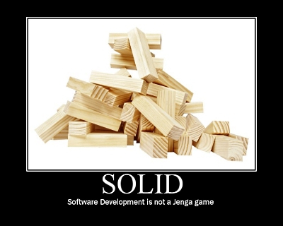
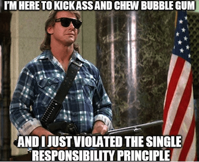
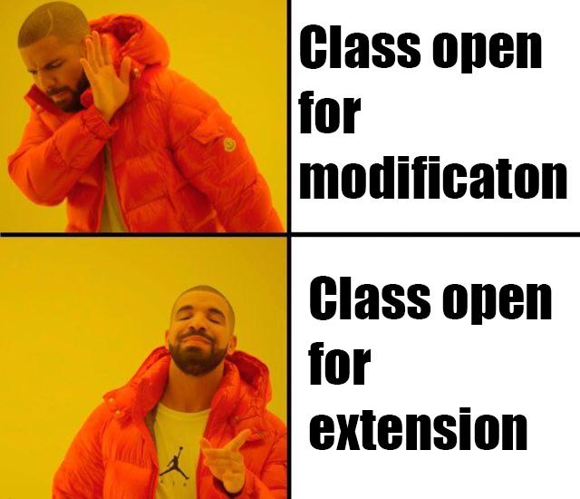
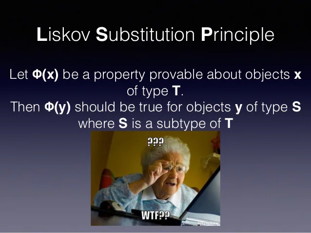
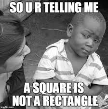
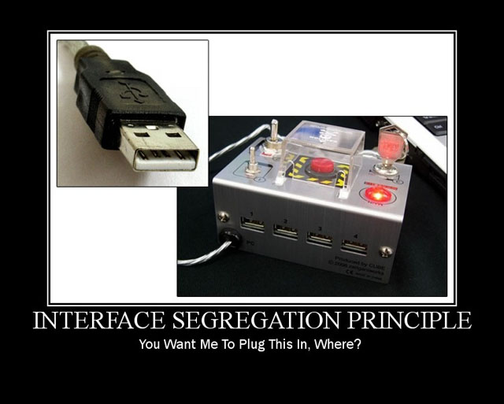
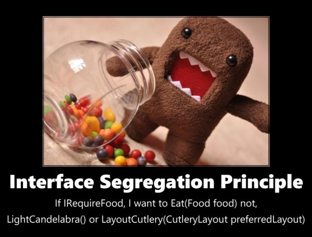
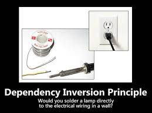

# SOLID principles  with  22 examples  .


 


#### Note : Fell free to add more examples and correct violations. [22 examples](src/main/java/com/grt/solid)


## Experts Say
*  #### SOLID principles that every developer should be aware of .  I am like (ㆆ_ㆆ)
   <br>
   <br>
   
   


# S - Single Responsibility Principle

* #### A subsystem, module, class, or even a function, should not have more than one reason to change.
* #### Every class should have a single responsibility , it should have only one job .


* If a class has more than one responsibility, it becomes coupled.
A change to one responsibility might result to modification of the other responsibility.

* Compose method  pattern - Divide your code into methods that only perform a single, identifiable task. Keep all of the operations in a single method at the same level of abstraction 
  <br> Single level of abstraction [SLAP](src/main/java/com/grt/bonus/OtherTopics.md#slap) .
* Applications will be more [cohesive](src/main/java/com/grt/bonus/OtherTopics.md#cohesion) .
  

### Quick naive examples:
BAD
```
class Book(){
    getName(){}
    createBook(b){books.insert(b);}
}
```
GOOD
```
class Book(){
    getName(){}    
}
class BookDao(){
    createBook(b){books.insert(b);}
}
```
Why Database management and properties management should be at same place?
<br>
<br>

<br/><br/>BAD
```
class Service(){
    updateStudnetInfo(Student s){}
    createStudent(Student s){}
    createCourse(Course c){}
    deleteCourse(Course c){}
}
```
GOOD
```
class StudentService(){
    updateStudnetInfo(Student s){}
    createStudent(Student s){}
}
class CourseService(){
    createCourse(Course c){}
    deleteCourse(Course c){}
}
```


# O - Open Closed Principle

* #### Software entities should be Open for extension, but closed for modification.

* “Open to extension” means that you should design your classes so that new functionality can be added as new requirements are generated.
  
* “Closed for modification” means that once you have developed a class you should never modify it, except to correct bugs.

* Above two statements are contradictory , How is it possible ?
<br><br>


* Applying OCP to your projects limits the need to change source code once it has been written, tested, and debugged. 
*  This reduces the risk of introducing new bugs to existing code, leading to more robust software.

### Quick naive example:
BAD
```
class Student {
    String type;   
    void introduce() {
        if ("highSchool".equals(type)) {
            print("I am an high school student");
        } else if ("underGraduate".equals(type)) {
            print("I am a under graduate student");
        } else {
            print("I am a common student");
        }
    }
}
```
GOOD
```
class Student {
    String type;   
    void introduce() {
       print("I am a common student");
    }
}
class HighSchoolStudent extends Student {
    String type;   
    void introduce() {
       print("I am an high school student");
    }
}
class GraduateStudent extends Student {
    String type;   
    void introduce() {
       print("I am a under graduate student");
    }
}
```
Making Student class open for extension by providing capability to add new types of students and closed for modification as when a new type of student is added no modifications are required.



Experts say : Strategy Pattern is a great demonstration of the open/closed principle. 
Experts also Say : A Class cannot be infinitely extensible .
ex: Car class is extensible for adding a new type of engine but not multiple engines . There can be a limitation of the design.
More extensibility -->  increase complexity .


# L - Liskov Substitution Principle

* #### A sub-class must be substitutable for its super-class

* Objects in a program should be replaceable with instances of their subtypes without altering the correctness of that program.

* Base types must be completely substitutable with the derived types

* Basically, derived classes should never do less than their base class.



Few Violations:


```
java.util.Stack;

Stack extends from Vector<> which means that all the properties of a vector are applicable to stack .
Which conceptually makes it violating Lsp . Say a client is using a base class Vector , Lsp states that all the subtypes must substitute its supertype.
When we substitute stack in the place of vector , though it doesnt break the code , conceptually its breaking as for stack it should not allow push at a particular index.    
Example:
class VectorT {
    void pushInd(){
        System.out.println("Pushing at ind");
    }
    void push(){
        System.out.println("Push at top");
    }
}

class StackT extends VectorT {
   // If pushInd is overridden with restriction
    @Override
    void pushInd() {
        System.out.println("Restricted");
        throw new Exception();
    }
}


public class A {
    static void process(VectorT st ){
        st.pushInd();
    }
    public static void main(String[] args) {
    //  This will work as usual 
            VectorT st = new VectorT();
            process(st);
            
    //  This will restrict and throw exception
    // Violating LSP where the subtype (StackT) is substituting superType (VectorT) 
            VectorT st = new StackT();
            process(st);    
            
    }
}

```


BAD 
```
interface Duck{
  void layEgg();
}
class DomesticDuck{
  void layEgg(){};
}
class ElectronicDuck{
  void layEgg(){throw new Exception();};
}

```

BAD 
```
public void SetWidth(Rectangle rect, int width)
{
    rect.Width = width;
}


Rectangle rect = new Rectangle(50, 20); // width, height
SetWidth(rect, 100);
Assert.AreEqual(20, rect.Height);

Rectangle rect = new Square(20); // both width and height
SetWidth(rect, 100);
Assert.AreEqual(20, rect.Height);

```
That test will fail, because setting a square's width to 100 will also change its height.
<br>Thus, Liskov's substitution principle is violated by deriving Square from Rectangle.



BAD
```
interface Account {
    void processLocalTransfer(double amount);
    void processInternationalTransfer(double amount);
}
class SchoolAccount implements Account {
    public void processLocalTransfer(double amount) {
        // some logic
    }
    public void processInternationalTransfer(double amount) {
        // either empty body or throw exception
    }
}
``` 
GOOD -  used interface segregation to solve LSP violation
```
interface LocalAccount {
    void processLocalTransfer(double amount);
}
interface InternationalAccount {
    void processInternationalTransfer(double amount);
}
class SchoolAccount implements LocalAccount {
    public void processLocalTransfer(double amount) {
        // some logic
    }
}
```


# I - Interface Segregation Principle

* #### Many client-specific interfaces are better than one general-purpose interface. Here, the idea is split the ‘big’ interface to the smaller interface until client of the interface will only know about the methods that are related to them.

* Create abstractions (Interfaces) using their roles and divide their responsibilities so that each client implementing these interfaces can use just about the right interface or combination of interfaces that describes their role/responsibilities.

* Segragate interfaces into multiple , such that each interface only focus on a single thing .

#### It's ok i will make it simple 




##### Whats there in the image ?
A client needs to use the ‘charge device’ class. They want to plug in a USB. They do not need VGAs or HDMIs. Interface Separation Principle allows for a large ‘Charge Device’ class with interfaces for ‘iUSB’ etc to only implement the methods they need.

ex: 
```
interface Printer{
  print();
  scan();
  photocopy();
  fax();
}
```
If a new function has to be added to the printer , all the classes that implements printer has to incorporate the new changes .
<br>
There by segregating the interfces , a class can be implemented from only given required interfaces .


Quick Example
<br>BAD
```
public interface Study {
    void createPaper();
    void createThesis();
}
...
public class Student implements Study {
    public void createPaper() {
        // create a paper
    }
    public void createThesis() {
        throw new IllegalStateException("not implement yet");
    }
}
...
public class UnderGraduateStudent extends Student {
    @Override
    public void createThesis() {
        // create a thesis
    }
}
```

GOOD
```
public interface PaperAble {
    void createPaper();
}
...
public interface ThesisAble {
    void createThesis();
}
...
public class Student implements PaperAble {
    public void createPaper() {
        // create a paper
    }
}
...
public class UnderGraduateStudent extends Student implements ThesisAble {
    public void createThesis() {
        // create a thesis
    }
}
```


# D - Dependency Inversion Principle

* #### Dependency should be on abstractions not concretions

* High level modules should not depend on low level modules, both should depend on abstractions.



Think about a lamp as a high level module , for turning it on do you really solder it to the electrical wiring in a wall . You just use an abstract outlet to connect . No need to implement low level dependency logic in high level modules , instead keep it abstract       

Quick example for the above statement
BAD
```
public class Button {     // HighlevelModule
    Lamp lamp;
    Button(Lamp lamp){    // LowlevelModule
        this.lamp = lamp;
    }
    void toggle(){}
}
```
GOOD
```
interface IDevice{
  void on();
  void off();
}
public class Button {     // HighlevelModule
    IDevice device;
    Button(IDevice device){    // LowlevelModule
        this.device = device;
    }
    void toggle(){}
}
```
* Abstractions should not depend on details. Details should depend upon abstractions.

HighLevel -<br>
Modules that define **what** the software should do, written to solve real problem and use cases. Its abstract and map to the business domain.

LowLevel -<br>
Modules that define **how** the software do, contain implementation details that are required to execute the business policies. For example logging, data access, I/O, network communication.

##### The Adapter Pattern is a good example of DIP.

---

End!

---


### These [22 examples](src/main/java/com/grt/solid) may help :)
